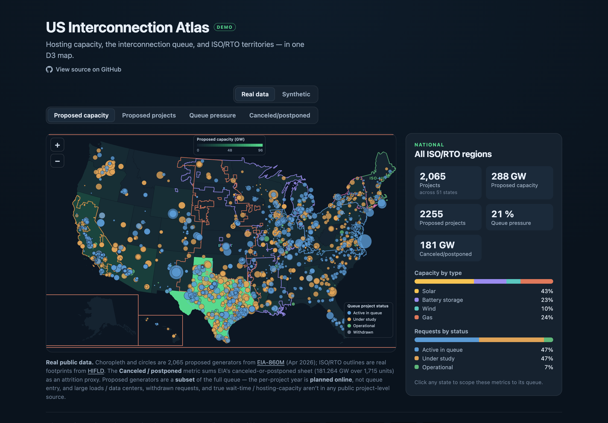

# interconnection-atlas

An interactive D3 map of US grid interconnection: a hosting-capacity choropleth with the interconnection queue and ISO/RTO territories layered on top, plus a metric toggle and a region-scoped detail panel.

[Open the live demo →](https://johncarmack1984.github.io/interconnection-atlas/). Runs entirely in the browser on synthetic data.

[](https://johncarmack1984.github.io/interconnection-atlas/)

## Why this exists

Connecting a new solar farm, battery, or data center to the grid means entering an interconnection queue and waiting through multi-year study processes. Most of that delay is process and data, not physics, and a large share of queued projects never get built. The people working this problem (renewable and large-load developers, and the software companies serving them) reason in terms of hosting capacity, queue depth and wait time, and ISO/RTO territory. This map puts those three things in one view.

It also bridges from prior adtech work: an interactive Mapbox GL + Turf.js choropleth for market-level targeting, ZIP/DMA polygons colored by a reach/frequency metric, with selection, legends, and a metrics side-panel. This is that exact technique pointed at the grid: same choropleth-plus-points-plus-panel pattern, new domain, rebuilt in pure D3 geo (projection + TopoJSON) rather than Mapbox.

## What it shows

- **Choropleth** of the 50 states + DC, recolored live by a metric toggle. Synthetic mode: available hosting capacity (MW), median queue wait (months), or active queue volume (GW). Real mode: proposed capacity (GW), proposed projects, queue pressure (proposed ÷ existing), or canceled / postponed (GW). Each metric has its own dark-theme sequential ramp.
- **Interconnection-queue projects** as points, positioned by lon/lat through the same projection, sized by capacity and colored by status (active / under study / operational / withdrawn). Project types include solar, storage, wind, gas, and large load (data centers), the new driver of queue growth.
- **ISO/RTO territory outlines**, built at load time by merging member-state geometries with `topojson.merge`, labeled at their centroids (CAISO, ERCOT, MISO, SPP, PJM, NYISO, ISO-NE).
- A **detail panel** that starts national and rescopes to any state you click: project count, a stat per active metric (rolled up nationally or scoped to the selected state), and capacity-by-type / requests-by-status mixes. (A reach/frequency-style metrics panel, repurposed for queue composition.)

## The exported module

The map is the package; the `examples/` app is one implementation of it.

```tsx
import { InterconnectionAtlas } from "interconnection-atlas"

<InterconnectionAtlas
  regions={regions}            // GeoJSON FeatureCollection of region polygons
  isoOutlines={isoOutlines}    // merged ISO/RTO boundaries (drawn as outlines)
  values={values}              // Map<regionId, number> → choropleth fill
  domain={[min, max]}
  colorInterpolator={d3.interpolateGreens}
  valueLabel="Available hosting capacity (MW)"
  formatValue={(n) => `${n}`}
  projects={projects}          // QueueProject[] → points
  selectedStateId={selected}
  onSelectState={setSelected}
/>
```

It depends only on `d3` (and `react`/`react-dom` as peers). It takes already-projected-agnostic GeoJSON in and owns the projection (`geoAlbersUsa`, fit to size), the color scale, point placement, legends, and tooltips. The example supplies the data and the metric/panel orchestration, so the component stays a reusable map rather than a one-off screen.

## Data

The map toggles between real and synthetic data (top-right). Both are bundled as a fixed snapshot, no backend, no runtime fetch, so the demo stays fully static, deterministic, and offline-capable.

**Real mode** draws from two free, public-domain sources, vendored into small committed JSON by `bun run build:data` (see `examples/scripts/build-real-data.ts`):

- **Proposed generators**: [EIA-860M](https://www.eia.gov/electricity/data/eia860m), the monthly inventory of planned generators: ~2,000 projects with real coordinates, nameplate MW, technology, and development status. These power both the queue points and the per-state choropleth (proposed capacity, project count, and a proposed-÷-existing "queue pressure" ratio normalized with EIA-860M existing capacity).
- **ISO/RTO footprints**: [HIFLD](https://hifld-geoplatform.hub.arcgis.com) "Control Areas" (balancing-authority boundaries; for these seven the BA footprint is the ISO footprint), Douglas-Peucker-simplified for the web.

Honest scope: EIA-860M "planned" generators are a subset of the full interconnection queue: no withdrawn or early-study requests, and no large loads / data centers (that queue has no public project-level source). EIA carries no queue-entry date, so the per-project year is labeled "Planned online" (its planned-operation year), not queue entry. The Canceled / postponed metric sums EIA-860M's canceled-or-postponed sheet per state as an automatable attrition proxy, distinct from interconnection-queue withdrawals, which aren't public. A true transmission "hosting capacity (MW)" per state isn't public either (FERC base cases are CEII-restricted), so the real choropleth is reframed as proposed capacity / queue pressure rather than headroom.

**Synthetic mode** is the original illustrative dataset: the [`us-atlas`](https://github.com/topojson/us-atlas) geometry is real, but every capacity/queue number comes from a seeded PRNG (identical on every load), shaped to echo real patterns (solar + storage dominant, heavy withdrawal, ERCOT fast / PJM slow) and is not actual filings. Its ISO outlines use a simplified one-operator-per-state merge, a deliberate contrast with the real footprints in real mode.

## Run it

A Bun workspace: the library is the root, `examples/` is a Vite app that imports it from source (aliased, so edits to `src/` hot-reload).

```bash
bun install
bun run dev      # → http://localhost:47654
```

Port is pinned with `strictPort`. `bun run typecheck` type-checks the library in isolation. `cd examples && bun run build:data` regenerates the vendored real-data JSON from EIA-860M + HIFLD. The outputs are committed, so you only need this to refresh the snapshot.

## Stack

`d3-geo` · `d3-scale` / `d3-scale-chromatic` · `topojson-client` · `us-atlas` · React 19 · TypeScript · Vite.
